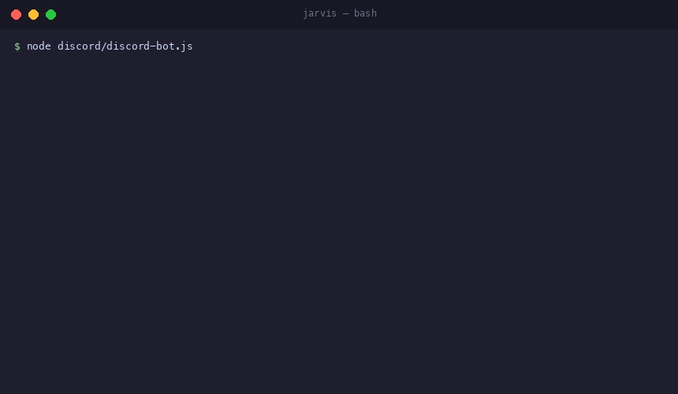

<div align="center">

<!-- Row 1: health & meta -->
<a href="https://github.com/Ramsbaby/jarvis/actions/workflows/ci.yml"></a>
<a href="https://github.com/Ramsbaby/jarvis/stargazers"></a>
<a href="https://github.com/Ramsbaby/jarvis/network/members"></a>


<!-- Row 2: key differentiators -->
<br>


<h1>Jarvis</h1>

<h3>놀고 있는 Claude Max 구독을 24/7 AI 운영 시스템으로</h3>

<p>
  <strong>
    Claude Max에 매달 $20–$100을 내고 있습니다. 하루 23시간 쉬고 있죠.<br>
    Jarvis는 그것을 Discord, 크론 작업, 로컬 메모리 엔진에 연결합니다 —<br>
    Claude가 자는 동안에도 일하고, 모니터링하고, 학습하게 됩니다. 추가 비용 $0.
  </strong>
</p>

<p>
  <a href="README.md">English</a> ·
  <a href="discord/SETUP.md">설치 가이드</a> ·
  <a href="docs/INDEX.md">문서</a> ·
  <a href="ROADMAP.md">로드맵</a> ·
  <a href="CHANGELOG.md">변경 이력</a>
</p>



</div>

---

## Jarvis가 뭔가요?

Jarvis는 `claude -p` — Claude Code의 헤드리스 출력 모드 — 위에 씌운 껍데기(harness)입니다. Claude를 **Discord**, **예약 크론 작업**, **로컬 RAG 메모리 시스템**에 연결해, 기존 구독을 개인 AI 운영팀으로 바꿔줍니다.

```
Discord에서 질문       →  Claude가 실시간 답변  →  메모리에 저장
매일 오전 8시 크론 실행  →  Claude가 스탠드업 작성  →  #bot-daily에 게시
오전 9시에 일어나면      →  브리핑·알림·우선순위 — 이미 준비되어 있음
```

**Anthropic API 키 없음. 종량 요금 없음. 클라우드 없음.** 그냥 `claude -p`.

---

## 핵심 인사이트: `claude -p`는 무료

대부분의 Discord 봇은 Anthropic API를 직접 호출합니다. 메시지마다 유료입니다. Jarvis는 다릅니다.

`claude -p`는 Claude Code의 **헤드리스 모드** — Anthropic이 자동화 파이프라인에서 공식 권장하는 방식입니다. 기존 Claude Max 구독 하에 실행되며, 호출당 요금이 없습니다.

| | Jarvis | API 기반 봇 | n8n + Claude |
|---|---|---|---|
| Claude 호출 방식 | `claude -p` (CLI, 구독 포함) | `POST /v1/messages` (종량제) | API 노드 (종량제) |
| 월 500건 비용 | **$0 추가** | ~$7–$37 추가 | API 비용 + n8n 요금 |
| 모델 품질 | Opus / Sonnet (내 구독 티어) | 키 등급에 따름 | 키 등급에 따름 |
| 능동적 자동화 | 49개 예약 태스크 (12팀) | 반응형만 | 비주얼 설정 필요 |
| 자가복구 | 4계층 자동 복구 | ❌ | ❌ |
| 장기 기억 | LanceDB 하이브리드 (로컬) | 드물게 | 선택 플러그인 |
| 컨텍스트 압축 | 98% (Nexus CIG 레이어) | ❌ | ❌ |
| 프라이버시 | 100% 로컬 | 다양함 | 다양함 |

> 이미 헬스장 월정액을 내고 있습니다. Jarvis는 그 헬스장을 매일, 심지어 자는 동안에도 실제로 쓰게 해주는 퍼스널 트레이너입니다.

---

## 자는 동안 일어나는 일

```
  시간     나           JARVIS
  ──────────────────────────────────────────────────────────────
  00:30    😴           → 로그 정리 + 정기 백업
  01:00    😴           → RAG 인덱스 업데이트 (매시간, 증분)
  03:00    😴           → 서버 유지보수 스캔  →  #bot-system
  04:45    😴           → 코드 오디터 전체 스크립트 검사 (내부)
  07:50    😴           → 트렌드팀: 아침 브리핑  →  #bot-daily
  08:00    😴           → Board Meeting: CEO OKR 검토  →  #bot-ceo
  08:05    😴           → 스탠드업 작성 및 게시 완료
  09:00    ☕            ← 기상: 브리핑·알림·우선순위 — 이미 준비됨
  10:00                 ↔ Discord 실시간 대화 (묻고 답하기)
  18:00                 ← 퇴근
  20:00    😴           → 기록팀: 일일 아카이브 (내부)
  ──────────────────────────────────────────────────────────────
                         49개 크론 태스크 · 12개 AI 팀 · 수동 개입 0
```

모든 태스크에 **지수 백오프 재시도**, **레이트 리밋 인식**, **실패 알림**(ntfy → 스마트폰 푸시)이 내장되어 있습니다.

---

## 핵심 지표

<table>
<tr>
<td align="center" width="33%">

### $0 / 월
*추가 비용*

모든 Discord 답변, 모든 크론 태스크, 모든 AI 팀 보고서가 `claude -p`를 호출합니다. Claude Max 구독에 포함. API 키 없음, 종량제 없음.

</td>
<td align="center" width="33%">

### 98%
*컨텍스트 압축*

Nexus CIG 레이어가 모든 툴 출력을 Claude의 컨텍스트 창에 들어오기 전에 가로챕니다. 실측값: **315 KB → 5.4 KB**. 30분이면 가득 찼을 컨텍스트가 수 시간 지속됩니다.

</td>
<td align="center" width="33%">

### 3시간+
*세션 지속 시간*

압축 없으면 컨텍스트가 ~30분에 포화됩니다. Nexus CIG 적용 시, 멀티턴 스레드가 auto-compact 트리거 전까지 몇 시간씩 유지됩니다.

</td>
</tr>
</table>

---

## 어떻게 작동하나요?

```
  Discord 메시지
        │
        ▼
  discord-bot.js  ──►  handlers.js  ──►  claude-runner.js
                                               │
                                         claude -p
                                       (내 구독 포함)
                                               │
                                       Nexus CIG (MCP)
                                       98% 컨텍스트 압축
                                               │
                                   Discord 답변  +  RAG 인덱스

  ──────────────────────────────────────────────────────────────

  크론 스케줄러  ──►  jarvis-cron.sh  ──►  tasks.json 파싱
                                               │
                                   depends[] 크로스팀 컨텍스트 자동 주입
                                               │
                                         claude -p
                                               │
                                   Discord  +  Obsidian Vault  +  RAG
```

### 자가복구 — 4계층 (사람 없이 자동)

| 계층 | 트리거 | 하는 일 |
|------|--------|---------|
| **0 · Preflight** | 매 콜드스타트 | `bot-preflight.sh`가 설정 유효성 검사; 오류 발생 시 Claude가 로그를 읽고 **파일을 스스로 수정** |
| **1 · OS 레벨** | 크래시 발생 시 | `launchd KeepAlive = true` — macOS가 OS 수준에서 봇을 재시작 |
| **2 · Watchdog** | 매 5분 | `watchdog.sh`가 로그 freshness 확인; 스테일 프로세스 종료 및 재시작 |
| **3 · Guardian** | 매 3분 | `launchd-guardian.sh`가 언로드된 LaunchAgent 자동 재등록 |

---

## 12개 AI 팀

각 팀은 고유한 역할과 시스템 프롬프트, 독립적인 크론 스케줄을 가집니다. Council이 작성하는 `context-bus.md`를 통해 모든 팀이 컨텍스트를 공유합니다.

| 팀 | 스케줄 | 역할 |
|----|--------|------|
| **Council** | 매일 23:00 | 크로스팀 종합; 전체 팀이 읽는 `context-bus.md` 작성 |
| **CEO Digest** | 매일 08:00 | 임원 요약: OKR 진척도, 주요 결정, 야간 이벤트 |
| **Standup** | 매일 08:05 | 아침 브리핑 — 일정, 태스크, 알림, 시장 현황 |
| **Infra** | 매 30분 | 서버 헬스, 프로세스 모니터링, 비용 알림 |
| **Finance** | 평일 | 시장 모니터링, 포트폴리오 추적, TQQQ/ETF 신호 |
| **Trend** | 매일 07:50 | 뉴스 다이제스트, 기술 트렌드 신호 |
| **Recon** | 주간 | 경쟁 인텔리전스, OSS 생태계 스캔 |
| **Security Scan** | 주간 | 의존성 감사, 자격증명 유출 탐지 |
| **Career** | 주간 | 성장 반성, 취업 시장 트렌드 추적 |
| **Academy** | 주간 | 리서치 다이제스트, 지식 베이스 관리 |
| **Record** | 매일 20:00 | 활동 아카이빙, 의사결정 감사 로그 (`decisions/*.jsonl`) |
| **Brand** | 주간 | 콘텐츠 포지셔닝 추적 |

**크로스팀 컨텍스트 흐름:** 전날 23:00에 Council이 작성한 인사이트가 다음 날 08:05 스탠드업 프롬프트에 `depends[]` 필드를 통해 자동 주입됩니다. 별도 코드 없음.

---

## 실제로 뭘 얻게 되나요?

개발자가 직접 사용 중인 수치입니다. 모두 실제 측정값입니다.

**매일 아침, 노트북을 열기 전에:**
- Discord에 스탠드업 게시: 일정 요약, 오늘 3대 우선순위, 야간 Jarvis 활동 내역
- 모니터링 중인 포지션이 임계값을 넘으면 스마트폰 푸시 (ntfy)
- GitHub 활동 체크; 리뷰 필요한 PR 알림
- CEO Digest가 OKR 진척도를 요약 → 전략적 맥락 파악 후 하루 시작

**업무 중에:**
- Discord에서 뭐든 물어보기 — Claude Opus/Sonnet 품질, 메시지당 비용 $0
- `/search <쿼리>`로 전체 지식 베이스(Obsidian + 크론 결과)를 시맨틱 검색
- `/run <태스크>`로 49개 크론 태스크 중 아무거나 즉시 실행
- 레이트 리밋 트래커가 일일 상한선을 넘지 않게 관리 (전형적 사용량: ~17%)

**자는 동안에:**
- Obsidian에서 노트를 편집하면 RAG 인덱스가 매시간 자동 업데이트
- Obsidian Vault 동기화: 팀 보고서, ADR, 일일 결정 사항이 구조화된 Markdown으로
- 모든 주요 결정이 `decisions/*.jsonl`에 영구 감사 로그로 기록
- 매 30분마다 시스템 헬스 체크; 이상 징후 발견 시 Discord 알림

**결론:** Claude가 하루 18–20시간 일합니다. 직접 하지 않고 10분 리뷰로 끝납니다.

---

## 빠른 시작

> **사전 요구사항:**
> - **Claude Max 구독** ($20–$100/월) — 모든 태스크가 `claude -p` 호출
> - **Claude Code CLI** — `npm install -g @anthropic-ai/claude-code` 후 `claude` 실행하여 인증
> - **Node.js 22+**, **jq**, [discord.com/developers](https://discord.com/developers)에서 **Discord 봇 토큰**

**Option A — Docker (가장 간단):**

```bash
git clone https://github.com/Ramsbaby/jarvis ~/.jarvis
cd ~/.jarvis
cp discord/.env.example discord/.env
# discord/.env에 DISCORD_TOKEN, GUILD_ID, CHANNEL_IDS 입력
docker compose up -d
```

**Option B — 네이티브 (macOS / Linux):**

```bash
git clone https://github.com/Ramsbaby/jarvis ~/.jarvis
cd ~/.jarvis
./install.sh              # 의존성 설치 + LaunchAgent + crontab 설정
# discord/.env 편집 후:
node discord/discord-bot.js
```

**macOS 24/7 자동재시작 (크래시 시, 로그인 시):**

```bash
launchctl load ~/Library/LaunchAgents/ai.jarvis.discord-bot.plist
```

전체 단계별 가이드는 [discord/SETUP.md](discord/SETUP.md) 참고.

### 의존성 티어

| 티어 | 명령어 | 용량 | 기능 |
|------|--------|------|------|
| **0 · Core** | `./install.sh --tier 0` | ~150 MB | Discord 봇 기본, RAG 없음 |
| **1 · Standard** | `./install.sh --tier 1` | ~350 MB | + SQLite 히스토리 + BM25 검색 |
| **2 · Full** | `./install.sh` (기본) | ~700 MB | + LanceDB 벡터 검색 + OpenAI 임베딩 |

---

## 설정

**`discord/.env`** — `.env.example`에서 복사

```env
BOT_NAME=Jarvis
BOT_LOCALE=ko                      # en 또는 ko
DISCORD_TOKEN=                     # discord.com/developers에서 발급
GUILD_ID=                          # Discord 서버 ID
CHANNEL_IDS=                       # 봇이 감시할 채널 ID (쉼표 구분)
OWNER_NAME=이름
OPENAI_API_KEY=                    # 선택: 벡터 RAG 임베딩용
NTFY_TOPIC=                        # 선택: ntfy.sh 모바일 푸시
```

**`config/tasks.json`** — 나만의 크론 태스크 정의:

```json
{
  "id": "morning-standup",
  "name": "모닝 스탠드업",
  "schedule": "5 8 * * *",
  "prompt": "오늘의 최우선 사항을 일정과 최근 컨텍스트를 바탕으로 요약해줘.",
  "output": ["discord"],
  "discordChannel": "bot-daily",
  "depends": ["council-insight", "tqqq-monitor"],
  "retry": { "max": 3, "backoff": "exponential" }
}
```

`depends` 배열이 크로스팀 컨텍스트를 자동 주입합니다: `tqqq-monitor`가 오늘 실행됐다면 그 결과가 스탠드업 프롬프트 앞에 자동으로 붙습니다.

---

## 슬래시 명령어

| 명령어 | 기능 |
|--------|------|
| `/search <쿼리>` | RAG 지식 베이스 시맨틱 검색 |
| `/status` | 시스템 헬스: 업타임, 레이트 리밋, 크론 현황 |
| `/tasks` | 등록된 크론 태스크 목록과 스케줄 |
| `/run <태스크ID>` | 크론 태스크 즉시 수동 실행 |
| `/threads` | 최근 대화 스레드 목록 |
| `/alert <메시지>` | Discord + ntfy 모바일 푸시 동시 전송 |
| `/usage` | 토큰 사용량 + 레이트 리밋 통계 |
| `/remember <텍스트>` | RAG에 영구 메모리 항목 저장 |
| `/clear` | 현재 세션 컨텍스트 초기화 |
| `/stop` | 실행 중인 `claude -p` 프로세스 중단 |

---

## 로드맵

| 단계 | 상태 | 내용 |
|------|------|------|
| **Phase 0** | ✅ 완료 | 버그 수정, 구조화 로깅, 4계층 자가복구 |
| **Phase 1** | ✅ 완료 | LLM Gateway (멀티프로바이더), Bash/Node 모듈 분리 |
| **Phase 2** | ✅ 완료 | 플러그인 시스템, Lite/Company 모드, Team YAML, `jarvis init` |
| **Phase 3** | ✅ 완료 | 오픈소스 공개 (체크리스트 12/12), Nexus CIG v3 |
| **Phase 4** | 🔜 예정 | 웹 대시보드, Slack 어댑터, 다국어 지원 |

자세한 내용과 기여 영역은 [ROADMAP.md](ROADMAP.md) 참고.

---

## 파일 구조

```
~/.jarvis/
├── discord/          # Discord 클라이언트, 핸들러, 포맷터, 슬래시 명령어
├── bin/              # 진입점: ask-claude.sh, bot-cron.sh, jarvis-init.sh
├── lib/              # 핵심: rag-engine.mjs, mcp-nexus.mjs, llm-gateway.sh
├── config/           # tasks.json, monitoring.json, anti-patterns.json
├── scripts/          # watchdog, 감사, vault-sync, KPI, E2E 테스트
├── teams/            # 12개 팀 정의 (YAML + 시스템 프롬프트)
├── plugins/          # 파일 컨벤션 플러그인 시스템 (.yml 하나 추가 = 등록)
├── context/          # 태스크별 배경 지식 (런타임에 자동 주입)
├── results/          # 크론 태스크 출력 이력
├── rag/              # LanceDB 데이터베이스 + 팀 보고서
├── agents/           # CEO, 인프라 총괄, 전략 어드바이저 에이전트 프로필
├── adr/              # 아키텍처 결정 기록 (ADR-001 ~ ADR-010)
└── docs/             # 아키텍처, 운영, 팀 문서
```

---

## 플랫폼별 참고

| 기능 | macOS (네이티브) | Linux / Docker |
|------|----------------|----------------|
| 프로세스 감시 | `launchd` KeepAlive — 크래시 시 재시작, 로그인 시 자동 시작 | Docker `restart: always` |
| Watchdog / Guardian | cron + bash (포함) | 동일 (컨테이너 내부 실행) |
| Apple 연동 | Notes.app, Reminders (선택) | 지원 안 함 |
| 스토리지 | 로컬 파일시스템 | Docker 볼륨 |

---

## 문서

| | |
|--|--|
| [discord/SETUP.md](discord/SETUP.md) | 전체 설치 가이드: 봇 생성, 채널 설정, 첫 실행 |
| [docs/ARCHITECTURE.md](docs/ARCHITECTURE.md) | 아키텍처 심층 분석: Nexus CIG, 자가복구, RAG |
| [docs/OPERATIONS.md](docs/OPERATIONS.md) | 크론 운영, 모니터링, 장애 대응 |
| [docs/TEAMS.md](docs/TEAMS.md) | 12개 AI 팀: 역할, 스케줄, 컨텍스트 흐름 |
| [adr/ADR-INDEX.md](adr/ADR-INDEX.md) | 아키텍처 결정 기록 (10개 결정 문서화) |
| [CHANGELOG.md](CHANGELOG.md) | 전체 릴리스 이력 |
| [ROADMAP.md](ROADMAP.md) | 예정 기능 및 기여 영역 |

---

## 기여하기

```bash
git clone https://github.com/Ramsbaby/jarvis
# 변경 작업
bash scripts/e2e-test.sh   # 50개 항목 로컬 검증
# Pull Request 오픈
```

Phase 4 항목(웹 대시보드, Slack 어댑터)에 대한 기여를 환영합니다. [ROADMAP.md](ROADMAP.md) 참고.

---

## 라이선스

MIT — [LICENSE](LICENSE) 참고

---

<p align="center">
  <a href="README.md">English README →</a>
  <br><br>
  Jarvis가 도움이 됐다면 ⭐ 하나가 다른 개발자들이 찾는 데 큰 힘이 됩니다.
</p>
